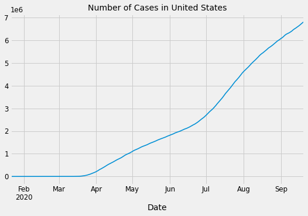
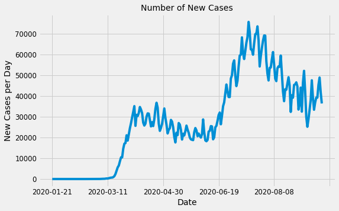
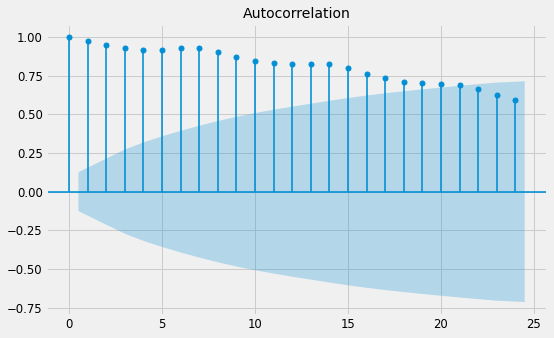
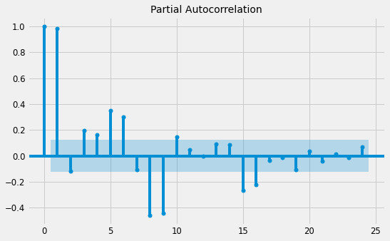
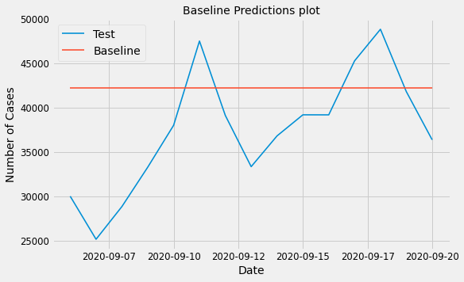
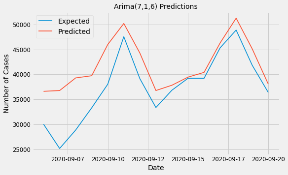

# Forecasting Covid-19 Cases
### By: Jagandeep Singh

## Introduction
In this project, my objective is to forecast number of Covid-19 cases in United States. Covid-19 has taken the world by storm after first  being reported in Wuhan, China in December 2019. Since then there is an exponential growth in number of cases around the world. Out of all the countries in the world, United States was hit hard. US has the highest number of cases and deaths in the world. In this project, I am going to perform time series forecasting on the number of cases to predict number of cases for next 7 days.

## Data
I am using three datasets for this project. First is the NY Times's ongoing data repository. They have data on number of cases and deaths in United States, States and Counties.
Here is the link to the repository:
https://github.com/nytimes/covid-19-data

Second dataset I am using is Google's Community Mobility Reports. The reports chart movement trends over time by geography, across different categories of places such as retail and recreation, groceries and pharmacies, parks, transit stations, workplaces, and residential.
Here is the link to the data:
https://www.google.com/covid19/mobility/

Third dataset is COVID-19 State and County Policy Orders. This contains all the policy updates due to Covid Pandemic in every State and County of United States.
Here is the link to the data:
https://healthdata.gov/dataset/covid-19-state-and-county-policy-orders

## Notebooks
- without_exog.ipynb
This notebook contains different models to forecast the number of COVID-19 cases in United States as Time series without any exogenous variable.

- with_exog.ipynb
This notebook contains different models to forecast the number of COVID-19 cases in United States as Time series with exogenous variables. I have used Google Community Mobility Data and Policy data to add as exogenous variable.

- policy.ipynb
This notebook contains the extraction of useful information from the state policy updates dataset.

## Data Preprocessing
The NY-Times dataset had number of total cases in United States each day. I converted that to number of new cases each day. Then for Neural Network models I had to convert the data to 2-Dimensional array. Google community Mobility Reports had data for all the countries in and states of each country. At this time I am only looking to forecast the number of cases in United States, So I removed all other countries from that dataset. For the policy dataset, I only used the policy changes on state level. I calculated at any data how many states in US had mandatory mask, Shelter in place and Food and Drink restrictions. Then I put all these into pickles to use in other notebook.

## Data Analysis and Visualization
For Data analysis, I looked at a bunch of line plots for the data. There was an upward trend in the number of cases in United States. I also looked at seasonal decomposition graphs of the data which also shows that there is an upward trend but there is no seasonality in data.
Here are some visualizations of my data:

## Models
### Baseline Model
I have used a naive model as my Baseline model. My baseline model always predicts the last value. So If I plot the baseline model it will be a straight line.

### Models without Exogenous
I have tried several different models to forecast the number of cases. I tried Arima models with different hyper parameters. I ran a grid search with ARIMA parameters and got the best parameters. With best parameters the RMSE was 5528. I also tried couple Neural Network models but none of them gave me a better RMSE than 5528.

### Models with Exogenous
After trying models without exogeneous, I used other datasets. I used two other datasets to improve the RMSE. First I tried using Google Community Mobility Reports to forecast the number of cases, But It did not help improve the RMSE. Then I used the policy updates dataset and ran some models with mask policy, shelter in place and food and drink restrictions policies.

### Final Model
The best model had the RMSE of 4958. This model used four variables as exogenous. These four variables were 'Grocery and Pharmacy percent change', 'Retail and Recreation percent change', 'Number of states with mask mandatory restrictions' and 'Number of states with Food and Drink restrictions'.

## Conclusion

## Further Steps
I have only looked at forecasting of COVID-19 cases on country level. In future, I would like to forecast number of cases on state level and compare how policies in different states have effects on number of cases.  

Here is the link to my Presentation:
https://docs.google.com/presentation/d/1wGzRwaRTP-8JhZG0QGziiyQVdGLYBHFVYaT0JdaEDjE/edit?usp=sharing
