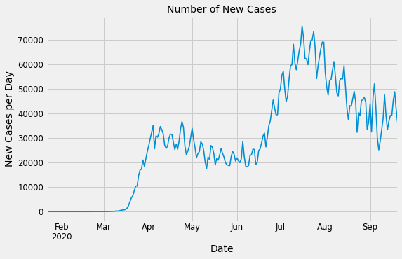

# Forecasting Covid-19 Cases
### By: Jagandeep Singh

## Introduction
In this project, my objective is to forecast number of Covid-19 cases in United States. Covid-19 has taken the world by storm after first  being reported in Wuhan, China in December 2019. Since then there is an exponential growth in number of cases around the world. Out of all the countries in the world, United States was hit hard. US has the highest number of cases and deaths in the world. In this project, I am going to perform time series forecasting on the number of cases to predict number of cases for next 7 days.

## Data
I am using two datasets for this project. First is the NY Times's ongoing data repository. They have data on number of cases and deaths in United States, States and Counties.
Here is the link to the repository:
https://github.com/nytimes/covid-19-data

Second dataset I am using is Google's Community Mobility Reports. The reports chart movement trends over time by geography, across different categories of places such as retail and recreation, groceries and pharmacies, parks, transit stations, workplaces, and residential.
Here is the link to the data:
https://www.google.com/covid19/mobility/

## Data Preprocassing
The dataset had number of total cases in United States each day. I converted that to number of new cases each day. Then for Neural Network models I had to convert the data to 2-Dimensional array. Google community Mobility Reports had data for all the countries in and states of each country. At this time I am only looking to forecast the number of cases in United States, So I removed all other countries from that dataset. 

## Data Analysis and Visualization
For Data analysis, I looked at a bunch of line plots for the data. There was an upward trend in the number of cases in United States. I also looked at seasonal decomposition graphs of the data which also shows that there is an upward trend but there is no seasonailty in data.
Here are some visualizations of my data:

## Models
In this project I have tried couple different models. My baseline model was just a naive model which was predicting the last value always. I had 8056 RMSE with that model. After that I tried Arima models with different hyper parameters. I ran a grid search with ARIMA parameters and got the best parameters. With best parameters the RMSE was 5528. I also tried couple Neural Network models but none of them gave me a better RMSE than 5528.

## Next Steps
This project is not completed. For next steps I will be trying more models on the data. Then I will be looking at the Google Comuunity Mobility Report and add that as an exogeneous variable in the data. I think using that data will improve my RMSE, since number of cases depend if people follow social distancing or not. There is no way to measure social distancing among population. But Google Comuunity Mobility Report can give us an idea of how people's visit changes to different places and how that affects the number of cases.
